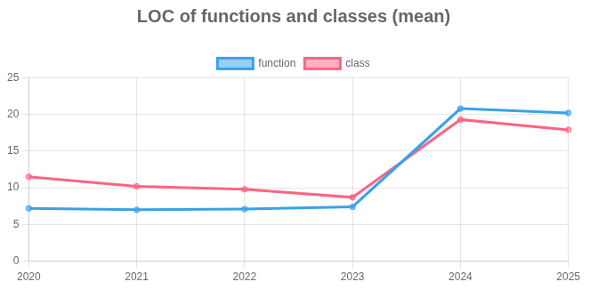

https://github.com/fastapi/fastapi

## Detalhamento da Evolução ao Longo do Tempo
O gráfico mostra a média de Linhas de Código (LOC) para funções e classes ao longo de seis anos, de 2020 a 2025.

Período Inicial (2020-2023): Durante esse período, as curvas são relativamente planas e estáveis. A média de LOC para funções fica em torno de 7 e, para classes, entre 8.7 e 11.5. Isso indica um crescimento orgânico e gradual do código, mantendo uma consistência no tamanho dos componentes.

Ponto de Virada (2023-2024): Entre 2023 e 2024, ocorre uma mudança abrupta e significativa. A média de LOC para funções dispara de 7.4 para 20.8, enquanto a média de classes aumenta de 8.7 para 19.3.

Período Recente (2024-2025): Após o grande salto, as médias de LOC se estabilizam, com uma leve queda em 2025 (funções para 20.2 e classes para 17.9). Isso sugere que o novo padrão de componentes maiores foi estabelecido.

## Análise de Boas Práticas e Qualidade do Código
De uma perspectiva de engenharia de software, a evolução das curvas indica uma mudança importante nas práticas de codificação.

Padrão Anterior (2020-2023): O baixo número médio de LOC por função e classe é uma forte evidência de boas práticas de design de software. Manter funções e classes pequenas facilita a leitura, manutenção e teste do código. Essa tendência está alinhada com princípios como a responsabilidade única (Single Responsibility Principle - SRP), onde cada componente tem uma única tarefa bem definida.

Padrão Atual (2024-2025): O salto em 2024, com funções e classes se tornando significativamente maiores, é um sinal de alerta. Isso pode indicar uma perda de coesão e um aumento da complexidade. Funções e classes maiores podem se tornar mais difíceis de entender e gerenciar, potencialmente levando a um aumento de bugs e a uma desaceleração no desenvolvimento futuro.

## Possíveis Explicações para a Grande Alteração em 2024
Em janeiro de 2024, houve uma atualização significativa no TestDriven.io: o template foi atualizado para FastAPI 0.109.0 e para Pydantic 2.5.3. Além disso, houve a introdução do pydantic-settings para gerenciamento de configurações e mudanças na imagem Docker usada uma série de adaptações que provavelmente demandaram mais código e reorganização significativa.
testdriven.io

A mudança para Pydantic v2 trouxe mudanças de API importantes e aumento de complexidade, especialmente em manipulação de validação e serialização, o que tende a gerar mais código.